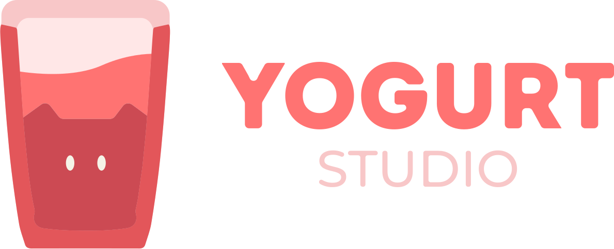

<h1 style="display: flex; justify-content: center; color: #FFFFFF;">👋 Приветствую на моем GitHub профиле!</h1>

  

  

<h2 style="display: flex; justify-content: center; color: #FFFFFF;">🚀 CEO & Fullstack Developer</h2>

  <em>Меня зовут — <strong>Кирилл</strong>, специализируюсь на создании веб-приложений полного цикла, управлении проектами и внедрении инноваций. Моя цель — превратить идеи в реальность с помощью кода.</em>

  
  
  

  

### 🔥 **Github Stats**

  

    <picture style="width: 100%">
      <source 
        srcset="https://github-readme-stats.vercel.app/api?username=kiri4tanker&show_icons=true&theme=dark&hide_border=true&icon_color=FFFFFF&title_color=8a53ff&bg_color=000000" 
        media="(prefers-color-scheme: dark)">
      <source 
        srcset="https://github-readme-stats.vercel.app/api?username=kiri4tanker&show_icons=true&theme=light&hide_border=true" 
        media="(prefers-color-scheme: light)">
      
    </picture>
    <picture style="width: 100%">
      <source 
        srcset="https://github-readme-streak-stats.herokuapp.com/?user=kiri4tanker&theme=dark&hide_border=true&background=000000&stroke=FFFFFF&ring=8a53ff&fire=8a53ff&currStreakNum=FFFFFF&currStreakLabel=FFFFFF" 
        media="(prefers-color-scheme: dark)">
      <source 
        srcset="https://github-readme-streak-stats.herokuapp.com/?user=kiri4tanker&theme=light&hide_border=true" 
        media="(prefers-color-scheme: light)">
      
    </picture>
  

  

    
  

  

### 🏢 **Организации**

  
  
  

  

### 🛠️ **Технологии и инструменты**

  
  
  
  
  
  
  
  
  
  
  
  
  
  
  
  
  

  

<h2 style="display: flex; justify-content: center; color: #FFFFFF;">📫 Контакты</h2>

  
  

  Спасибо, что заглянули! Давайте творить вместе! 🎉

